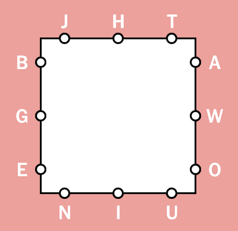

# Letter Boxed Solver
Solve NY Times' [Letter Boxed game](https://www.nytimes.com/puzzles/letter-boxed).

## How to use

`python letter-boxed.py -l jhtawouinbge`

Demo at [alexperathoner.github.io/nyt-letter-boxed](https://alexperathoner.github.io/nyt-letter-boxed/)

### Parameters:
- `-l` allowed letters. For example, if today's Letter Boxed looks like this:  </img>

	You should input `jhtawouinbge`. It's important that the four groups of letters are separated. The order inside the group is not important (e.g. `thjowaniuebg` is also valid and will work).
- `-w` change the words file (default is `30k.txt`). Included files are from [Josh Kaufman](https://github.com/first20hours/google-10000-english/blob/master/google-10000-english.txt) and [arstgit](https://github.com/arstgit/high-frequency-vocabulary/blob/master/30k.txt) (both originally from [Peter Norvig's website](http://norvig.com/ngrams/))
- `-a` search for all possible solutions, not just the best one.
- `-d` print intermediate steps while solving.
- `-h` prints basically this help.

## How it works
1. Filter all words that can't be used with the given letters (e.g. `hello` in the screenshot above isn't allowed, as `l` isn't in the given letters) and group letters (e.g. `wow` isn't allowed, as letters on one side of the square can't be followed by letters on the same side).
2. Recursively search for next "best" possible word. Possible words are words that start with the letter the previous word is ending in. "Best" is the word that adds most yet missing letters of the puzzle. If we're searching for all solutions we won't stop after the first correct series of words is found. We go through all possible combinations with the given file of words, and then search for the solution using the least amount of words. For the puzzle above, this is `['banjo', 'outweigh']`.

### Limitations
The input word file strongly changes the best solution. In the example above, with `30k` 124 solutions are found, with the shortest being just two words; with `10k` there are only 6 solutions, all 4 words long. However, using dictionaries containing more words, might include words that are not recognised by NYT's game, thus returning non-valid outputs.

## License

See the [LICENSE.md](LICENSE.md) file for details.

---
Donations are welcome!

